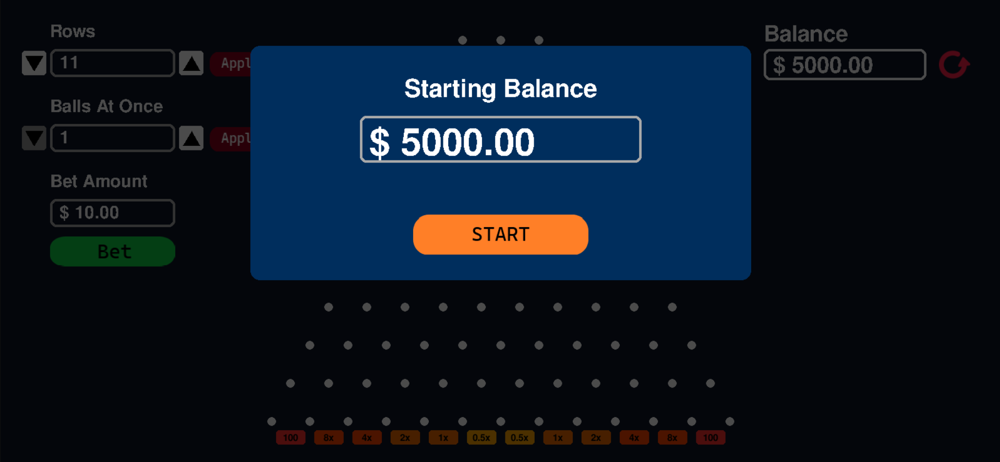

# Plinko Balls

I recreated the popular online Plinko gambling game using Python and Pygame, simulating the physics of a ball falling through a grid of pegs and landing in multiplier-based slots at the bottom.

## Links
[Playable Game](https://thucchi-cs.github.io/Plinko_Balls)

## How to Play

### Set Money
When you first open up the game. You can input the amount of fake money you want to play with. You can change or reset the amount anytime by clicking the red restart button at the top right corner of the screen.

### Other settings
On the left side of the screen, there are 3 settings you can change to customize your game: number of rows, number of balls dropped at once, and the bet amount. To change the settings, you can use the buttons provided or type it in yourself. For the rows and balls at once input, make sure you press "Apply" for the changes to be saved.
Your money will update on the left side of the screen as the balls drop.

## Physics
This game simulates the physics of regular plinko balls. However, as it is a gambling game, center bias is added so the balls tend to fall closer to the middle. Bounciness is also present for randomness.

## How It Was Made
This game was made originally by Thuc Chi Do ([thucchi-cs](https://github.com/thucchi-cs))

### Code
This game was made by Python's Pygame. It was converted to a web based game with Pygbag, and it is hosted on Github pages.

### Assets
All images of this game was made by me.